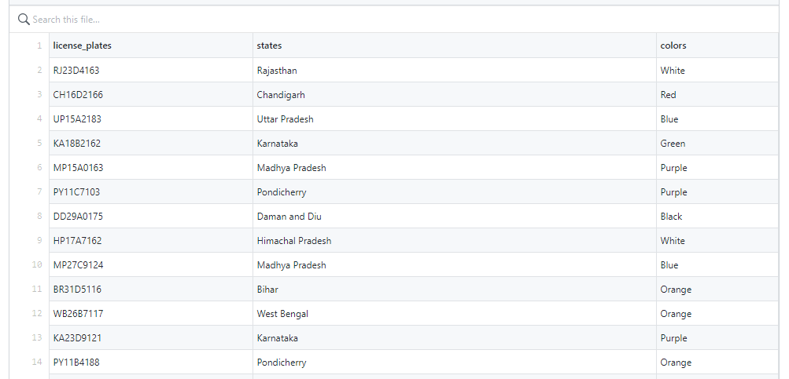
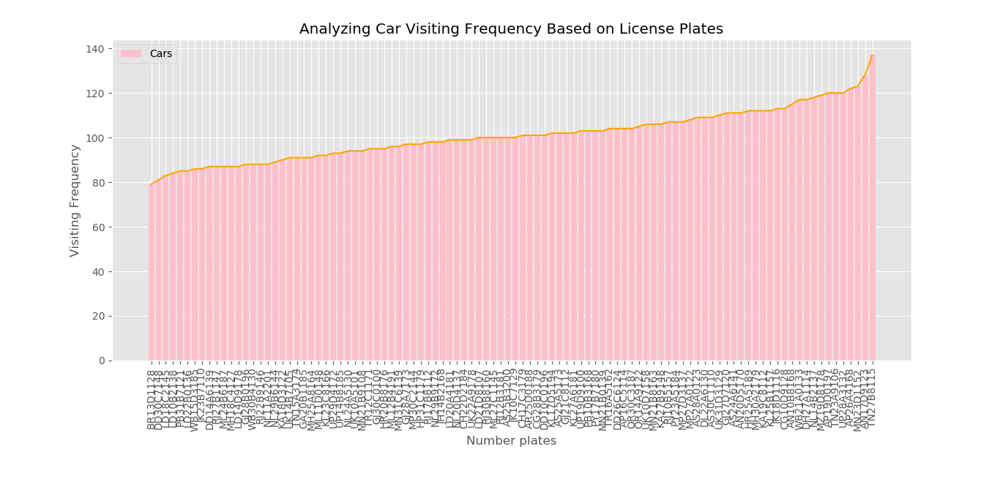
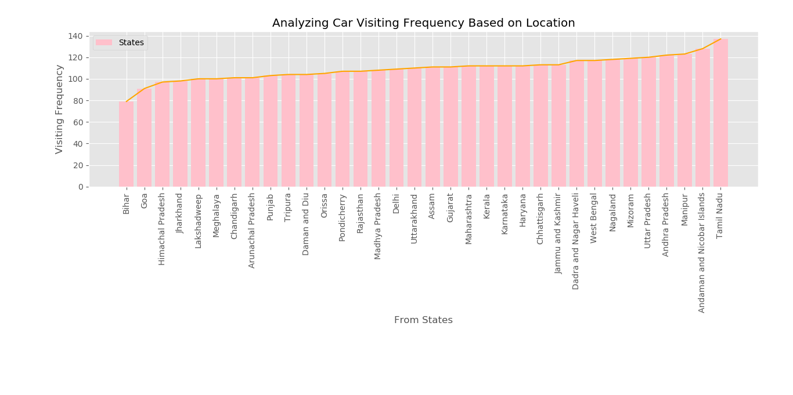
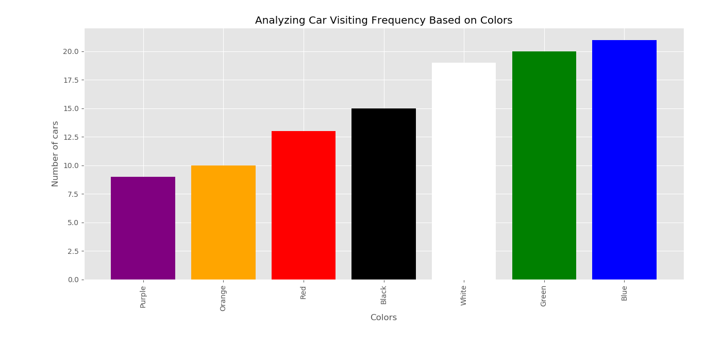

## Data Analysis

The python program ``generate_data.py`` is used to generate dummy i.e., ``car_data.csv`` for visualization.

The python program ``data_visualization.py`` is used to visualized the given data i.e., ``car_data.csv``

#### Modules required

```python
>> pip install pandas
>> pip install matplotlib
>> pip install numpy
```

#### Illustrations

> Generated Data


> Unique Visitors Analysis Based on Number plates
>
> 


> Unique Visitors Analysis Based on Location i.e., States.
>
> 


> Unique Visitors Analysis Based on Colors.
>
> 